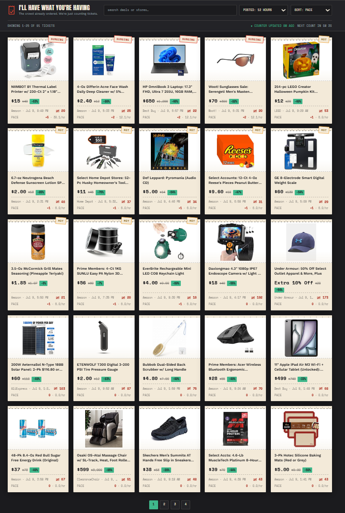

# Deal-feed screen audit

Date: 2026-07-09  
Mode: Combined UX and accessibility review  
Scope: One user-supplied desktop screenshot (851 x 1261 px) of the deal-feed browse state  
Assumed user goal: Find a worthwhile deal quickly, understand why it is trending, and open it confidently  
Accessibility target: WCAG 2.2 AA risk review; not a compliance claim

## Overall verdict

The ticket-counter concept is distinctive and the repeated card anatomy is consistent, but the screen is over-optimized for density. At the captured width, five columns turn the feed into a wall of receipts: the information is present, yet the title, merchant, recency, tally, velocity, and status signals are too small and too equal in weight to support fast comparison.

## Step 1 - Browse, filter, and choose a deal

Health: **Needs attention**

### Strengths

- The dark shell, warm ticket cards, stamps, and tally motif create a memorable identity that fits the product idea.
- Card dimensions and repeated content placement are consistent, so the pattern becomes learnable.
- Product imagery, current price, and green discount chips provide the clearest first-pass comparison signals.
- Search, time window, sort, result count, and pagination are all visible in the browse state.

### UX risks

1. **High - Density blocks scanability.** Five columns at this width force product titles and deal metadata into very small text. Twenty-five equally weighted cards make it hard to establish a shortlist.
2. **High - The cards lack one clear reading order.** Image, title, price, old price, discount, tally, `HOT`/`SURGING`, and `PACE` all compete. Users must decode the full card before they can compare it with the next one.
3. **High - Momentum language is opaque.** `PACE`, the tally glyph, and values such as `+5 at 30.1/hr` are not self-explanatory, and the difference between `HOT` and `SURGING` is not defined.
4. **Medium - Unlike offer types are presented as if they were comparable.** A direct price, an account-only offer, and `Extra 10% Off` occupy the same price area. Conditions are easy to miss while scanning.
5. **Medium - The next action is visually weak.** The cards do not show an obvious "open deal" affordance in the static state. The global controls are also small relative to the amount of content they govern.
6. **Polish - The motif becomes visual noise at scale.** Tilted stamps, torn edges, dashed separators, tiny tallies, and repeated status colors are charming individually but busy across 25 cards.

### Accessibility risks

1. **Text size and zoom resilience:** product titles, merchant/time metadata, status copy, and velocity values appear very small. Verify comfortable use at 200% zoom and 320 CSS px without preserving the five-column density.
2. **Contrast:** muted gray text on cream cards and gray status text on the dark header look vulnerable at these sizes. Verify at least 4.5:1 for normal text and 3:1 for meaningful component boundaries; do not rely on the screenshot for exact ratios.
3. **Control targets:** pagination appears especially small, and the header controls are shallow. Measure them against WCAG 2.2's 24 x 24 CSS px minimum where no exception applies, and use larger touch-friendly targets where practical.
4. **Labels and instructions:** the search field has no persistent visible label, and the activity metrics need plain-language explanations. Verify programmatic names for every input and metric.
5. **Live updates:** "counter updated" and "next count" imply automatic changes. Do not announce a per-second countdown to assistive technology, move keyboard focus, or silently reorder the user's current results; announce meaningful refreshes once.
6. **Unverified interaction behavior:** keyboard order, visible focus, hover-only cues, link purpose, screen-reader reading order, semantic headings, and new-tab behavior cannot be confirmed from this image.

## Highest-impact changes

1. **Reflow the grid.** Use four columns at this captured width, with roughly 180-200 px as a practical minimum card width; increase title and metadata sizes before adding more visual detail.
2. **Give every card the same scan path:** product title > current price and savings > merchant and age > one plain-language momentum line. Move secondary metrics behind details or a tooltip.
3. **Translate the model into user language.** Replace `PACE` with something such as `Trending speed` or `Votes/hour`; render `+5 at 30.1/hr` as `+5 votes in the last hour`; explain `HOT` and `SURGING` thresholds.
4. **Separate price, savings, and conditions.** Reserve the main price row for comparable values and show account, coupon, or store restrictions in a distinct condition line.
5. **Strengthen action and control affordances.** Make the deal link unmistakable, expose a strong keyboard focus state, enlarge pagination with Previous/Next controls, and consider quick filters for store, category, or minimum discount.
6. **Stabilize updates.** Keep the user's place when new data arrives and provide a deliberate "new deals available" refresh action if results would otherwise reorder.

## Evidence limits

This audit covers only the visible browse state in the accepted screenshot. It does not verify filter behavior, empty/error/loading states, deal navigation, mobile reflow, zoom behavior, keyboard access, focus styling, semantics, assistive-technology output, exact contrast ratios, or the behavior of automatic refreshes.

## Follow-up

The recommended implementation sequence and acceptance criteria are in [implementation-plan.md](./implementation-plan.md).

The [Figma audit file](https://www.figma.com/design/JBMAhe7rQSY3IEquckZ80B) contains the accepted screenshot and audit heading. Adding the remaining notes was blocked by the Figma Starter-plan MCP call limit.
