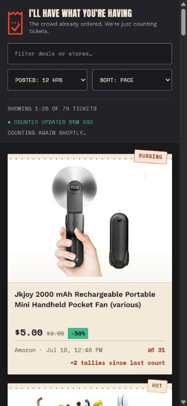
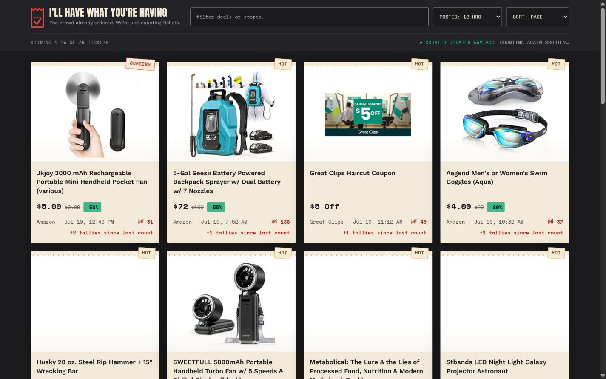
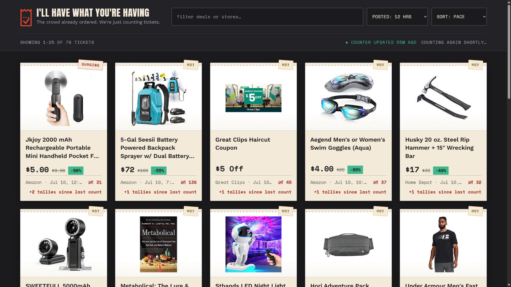

# Responsive Tally Audit

## Scope

Deal-card tally count and tally delta at 390×844 mobile, 1440×900 desktop, and 1920×1080 TV mode (`?tv=1`, representative of a 65-inch 1080p display).

## Verdict

The tally can and should be larger. The existing footer has enough vertical room, but both values currently share the smallest type tier with secondary metadata. Increase their visual priority independently by breakpoint; do not scale the entire footer uniformly.

## Evidence

1. **Mobile — healthy layout, weak numeric priority.** The one-column card is 343 px wide. Both tally and delta render at 12 px. The content fits, but the count is easy to miss and 12 px is a readability risk. Keep the two-row footer; use 14–15 px for the count and 12–13 px for the delta. Shorten visible delta copy to `+2 since last count` on narrow screens while retaining the full accessible label.

   

2. **Desktop — healthy density, tally undersized.** Four 306 px cards fit without crowding. Both tally and delta are 12 px, so neither separates from store/time metadata. Use 14–15 px for the count and 13–14 px for the delta. Keep the store/time line visually quieter.

   

3. **65-inch TV — layout is healthy, viewing-distance scale is insufficient.** TV mode grows the values to 16.5 px and keeps five 326 px cards across. The overall card remains balanced, but the tally data is still small from several feet away. Use 22–24 px for the count and 20–22 px for the delta, with a 1.25–1.35 line height. If space becomes tight, reduce the TV grid to four columns before truncating or shrinking the tally.

   

## Highest-impact changes

- Make the tally count the footer's primary metric: larger and bolder than source/time.
- Keep delta secondary but readable; positive/negative color should supplement, not replace, the signed number.
- Preserve the current two-row footer. It prevents the source, count, and explanatory delta from competing on one line.
- Reserve a stable one-line delta area so cards do not change height between `pending`, positive, and negative states.
- For TV, prefer fewer columns over adding more metadata or compressing the footer.

## Evidence limits

This is a screenshot and computed-layout audit. It does not verify real couch viewing distance, browser zoom behavior, focus order, screen-reader announcements, or contrast ratios under the physical TV's picture settings.
